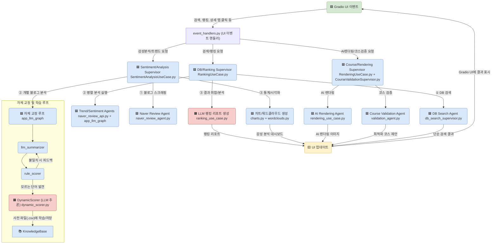

# FestMoment: AI 축제 가이드 🤖✨

> "축제의 순간을 AI로 재해석하다"
> 
> **Team FestMoment** | 염정운, 최가윤

**FestMoment**는 전국의 축제 데이터를 기반으로, LLM과 Vision 모델을 활용해 ‘AI 축제 가이드’를 생성하는 서비스입니다. 기존의 축제 정보 서비스가 일정과 위치 등 정형적인 정보 제공에 그쳤다면, FestMoment는 블로그 후기, 검색량 트렌드, 현장 이미지 등 비정형 데이터 속에 담긴 **감성**에 주목합니다.

AI가 사람의 감정과 이미지를 재해석하여, 사용자가 축제의 ‘순간’을 더 깊이 공감하고 생생하게 느낄 수 있는 새로운 경험을 제공하는 것을 목표로 합니다.

---

##  목차

1. [Why FestMoment?](#-why-festmoment--왜-만들었나요)
2. [핵심 컨셉: AI, 감성을 해석하고 그리다](#-the-magic--핵심-컨셉-ai-감성을-해석하고-그리다)
3. [주요 기능](#-주요-기능)
4. [기술 아키텍처](#-기술-아키텍처)
5. [기술 스택 및 데이터 소스](#-기술-스택-및-데이터-소스)
6. [폴더 구조](#-폴더-구조-클린-아키텍처-매핑)
7. [시작하기](#-시작하기)
8. [기대 효과 및 가치](#-기대-효과-및-가치)

---

## 🧐 Why FestMoment? | 왜 만들었나요?

> "축제 정보는 넘쳐나지만, **설렘**은 어디에 있나요?"

기존의 축제 앱들은 장소, 날짜, 가격 등 **사실(Fact)** 정보만 나열합니다. 하지만 우리가 정말 원하는 건 그 축제에 갔을 때 느낄 수 있는 **감성(Feeling)**과 **분위기**입니다.

**FestMoment**는 바로 이 지점에서 출발했습니다. AI 기술을 통해 데이터 속에 숨겨진 사람들의 감정을 분석하고, 이미지를 재해석하여 축제의 순간을 **미리, 그리고 더 깊이** 느낄 수 있게 만드는 것. 그것이 저희의 목표입니다.

---

## ✨ The Magic | 핵심 컨셉: AI, 감성을 해석하고 그리다

FestMoment는 3단계의 AI Magic을 통해 축제에 감성을 불어넣습니다.

1.  **데이터 융합 (Data Fusion)**
    - **공공 데이터(TourAPI)**의 정형 정보와 **민간 데이터(Naver Blog)**의 비정형 리뷰/이미지를 결합하여 축제의 입체적인 모습을 구성합니다.

2.  **AI 감성 분석 (AI Sentiment Analysis)**
    - **LLM(Gemini)**이 수많은 블로그 리뷰를 실시간으로 읽고, 사람들이 어떤 포인트에서 즐거워하고 아쉬워하는지 **감정의 맥락**을 파악합니다. 이를 통해 단순 긍/부정을 넘어선 깊이 있는 요약과 평점을 제공합니다.

3.  **AI 시각화 (AI Visualization)**
    - **Vision 모델**이 축제의 대표 이미지를 스스로 선정하고, 이를 **영화 포스터**처럼 재창조합니다. 또한, 축제 현장 사진을 기반으로 **사계절과 밤낮의 모습**을 그려내어, 가보지 않아도 그곳의 분위기를 느낄 수 있게 합니다.

---

## 🌟 주요 기능

FestMoment는 축제 검색부터 감성 분석, AI 이미지 생성까지 올인원(All-in-One) 경험을 제공합니다.

### 1. AI 심층 분석 (네이버 데이터 기반)

- **블로그 리뷰 AI 요약**: AI가 네이버 블로그 후기들을 실시간으로 분석하여 축제의 **장점, 단점, 방문 꿀팁**을 세 가지 핵심 포인트로 요약합니다. 방문객의 경험을 중심으로 한 상세 요약을 통해 실질적인 정보를 얻을 수 있습니다.
- **다차원 감성 분석 및 평점**: 자체 구축한 감성 사전(규칙 기반)과 Google Gemini(LLM 동적 분석)를 결합한 하이브리드 방식으로 감성 점수를 도출하고 직관적인 별점을 제공합니다. IQR(사분위수 범위)을 사용해 극단적인 이상치(Outlier) 리뷰를 필터링하여 점수의 객관성을 높였습니다.
- **검색량 트렌드 시각화**: 네이버 데이터랩 API를 통해 연간 검색량 추이를 그래프로 시각화하여 축제에 대한 대중의 관심도 변화를 한눈에 파악하게 해줍니다.
- **테마별 워드클라우드**: 블로그 후기에서 추출한 핵심 키워드를 '계절', '도시', '문화' 등 7가지 축제 테마에 맞는 마스크 이미지로 시각화하여 축제의 핵심 이미지를 감성적으로 전달합니다.

### 2. AI 렌더링 및 시각화

- **베스트 포토 & AI 렌더링 포스터**: 네이버 블로그 후기의 이미지를 실시간으로 분석하여 축제의 특징을 가장 잘 보여주는 시각적 대표 사진을 자동으로 선정하고, 이 이미지를 활용해 감성적인 영화 스타일의 포스터를 생성합니다.
- **AI 야경/계절 렌더링**: TourAPI의 실제 위치 이미지와 운영 시간을 분석하여 축제의 계절(봄/여름/가을/겨울)과 시간대(낮/밤)를 판별합니다. Gemini Vision과 Google Static Maps API를 활용해 사실적이면서도 예술적인 축제 장면을 AI로 재구성하여 현장감을 극대화합니다.
- **AI 아이콘 생성**: Gemini Vision 모델이 축제 현장 이미지를 분석하여 축제의 핵심 상징을 담은 아이콘을 생성합니다.

### 3. 검색 및 개인 맞춤형 가이드

- **상세 정보 및 다각적 검색**: 축제의 기간, 장소, 요금 등 기본 정보는 물론, '자연과 계절 > 봄 축제'와 같은 계층적 카테고리 및 지역별 필터링을 통해 원하는 축제를 손쉽게 찾을 수 있습니다.
- **객관적인 축제 랭킹**: 사용자 평점, 리뷰 수, 검색량 트렌드 데이터를 가중치로 종합하여 가장 인기 있는 축제 순위를 객관적으로 제공합니다.
- **나만의 여행 코스 설계 및 검증**: 사용자가 관심 있는 축제나 장소를 담아 여행 일정을 만들면, AI가 해당 일정의 현실성(이동 시간, 동선)과 완성도를 검토하고 피드백을 제공합니다.
- **지도 기반 주변 추천**: 축제 위치를 중심으로, 설정된 반경(100m ~ 20km) 내의 추천 여행 코스와 문화시설 정보를 함께 제공합니다.

---

## 🏗️ 기술 아키텍처

본 프로젝트는 Python을 기반으로, **LangGraph**를 활용하여 각 기능 모듈을 자율적으로 수행하는 **계층적 에이전트 아키텍처**를 구축했습니다. 이를 통해 복잡한 비즈니스 로직을 유연하고 확장 가능하게 관리합니다.

- **메인 컨트롤러 (`event_handlers.py`)**: Gradio UI의 이벤트를 받아, 요청에 맞는 하위 슈퍼바이저나 에이전트를 호출하는 라우터 역할을 합니다.
- **슈퍼바이저 (`supervisors/`)**: "DB 검색", "코스 검증" 등 특정 도메인의 작업을 담당하며, 내부적으로 여러 에이전트 노드를 실행하고 조율합니다.
- **유스케이스 에이전트 (`use_cases/`)**: `RankingUseCase`, `SentimentAnalysisUseCase` 등 여러 도구와 그래프를 순차적/병렬적으로 호출하여 복잡한 비즈니스 로직을 수행합니다.
- **핵심 하위 그래프 (`graph.py`)**: 여러 에이전트가 공용으로 사용하는 '리뷰 1개 분석'과 같은 재사용 가능한 워크플로우를 정의합니다. (예: 검증 → 요약 → 점수 계산 → 피드백 루프)

### LangGraph 계층 구조 다이어그램




---

## 🛠️ 기술 스택 및 데이터 소스

### 주요 기술 스택
- **언어**: Python
- **AI 프레임워크**: LangGraph (계층적 에이전트 아키텍처)
- **LLM**: Google Gemini (Pro, Flash, Vision)
- **UI**: Gradio
- **데이터 처리**: Pandas, Konlpy (형태소 분석), Geopy
- **데이터 시각화**: Matplotlib, Wordcloud
- **웹 스크래핑**: Playwright, Selenium
- **데이터베이스**: SQLite

### 데이터 소스
- **축제 정보**: 한국관광공사 (TourAPI)
- **리뷰 및 트렌드**: Naver Search API, Naver DataLab API
- **지도 및 위치**: Google Static Maps API
- **자체 DB**: 축제 분류 정보, 감성 분석용 사전 (`dic/`)

---

## 📁 폴더 구조 (클린 아키텍처 매핑)

```
.
├── app.py                  # 🔵 Presentation: 메인 실행 파일 (Gradio UI)
├── requirements.txt
├── tour.db                 # 🟢 Infrastructure: SQLite 데이터베이스
├── assets/                 # 🔵 Presentation: 정적 자산 (이미지, 마스크 등)
├── database/               # 🟢 Infrastructure: DB 초기화용 CSV
├── dic/                    # 🟡 Domain: 감성 분석용 사전 (형용사, 부사, 명사 등)
├── src/
│   ├── application/        # 🟣 Application: 비즈니스 로직, 유스케이스
│   │   ├── agents/         # LangGraph 에이전트 노드 정의
│   │   ├── core/           # LangGraph 핵심 (State, Graph, Utils)
│   │   ├── supervisors/    # LangGraph 감독자 (라우터) 정의
│   │   └── use_cases/      # 복잡한 비즈니스 로직 (Agent)
│   ├── domain/             # 🟡 Domain: 핵심 비즈니스 규칙, 엔티티
│   │   └── knowledge_base.py # 감성 사전 로딩
│   ├── infrastructure/     # 🟢 Infrastructure: 외부 서비스, DB, 설정
│   │   ├── config/         # 환경 설정
│   │   ├── external_services/ # 외부 API 연동
│   │   ├── persistence/    # 데이터 영속성 (SQLite)
│   │   ├── reporting/      # 시각화 (Charts, Wordclouds)
│   │   ├── dynamic_scorer.py # 동적 감성 점수 계산
│   │   └── llm_client.py   # LLM 클라이언트 초기화
│   └── presentation/       # 🔵 Presentation: UI 로직
│       ├── callbacks.py    # UI 콜백 (드롭다운 연동 등)
│       ├── event_handlers.py # UI 이벤트 - Application 연결 (메인 컨트롤러)
│       └── ui.py           # Gradio UI 컴포넌트 정의
```

---

## 🏁 시작하기

### 1. 환경 설정

**의존성 설치**

`requirements.txt` 파일에 명시된 모든 Python 패키지를 설치합니다.
```bash
pip install -r requirements.txt
```

**.env 파일 설정**

프로젝트 루트 디렉토리(`FestMoment/`)에 `.env` 파일을 생성하고 다음 환경 변수를 설정합니다.
```
# Google Gemini API Key
GOOGLE_API_KEY="YOUR_GOOGLE_GEMINI_API_KEY"

# Naver API Keys for Blog Search
NAVER_CLIENT_ID="YOUR_NAVER_CLIENT_ID"
NAVER_CLIENT_SECRET="YOUR_NAVER_CLIENT_SECRET"

# Naver API Keys for DataLab Trend
NAVER_TREND_CLIENT_ID="YOUR_NAVER_TREND_CLIENT_ID"
NAVER_TREND_CLIENT_SECRET="YOUR_NAVER_TREND_CLIENT_SECRET"
```

### 2. 데이터베이스 설정

애플리케이션을 처음 실행할 때 `app.py`가 `init_db()`를 호출하여 `database/` 폴더의 CSV 파일로부터 `tour.db`를 자동으로 생성합니다.

### 3. 애플리케이션 실행

프로젝트 루트 디렉토리에서 다음 명령어를 실행하여 Gradio 웹 인터페이스를 시작합니다.
```bash
python app.py
```
애플리케이션이 실행되면 웹 브라우저에서 `http://127.0.0.1:7860` (또는 터미널에 표시되는 URL)로 접속하여 사용할 수 있습니다.

---

## 💡 기대 효과 및 가치

- **사회적 효과**: AI가 한국의 문화유산을 시각적으로 재해석하여, 외국인 관광객에게 **한국 문화의 감정적 경험**을 제공합니다.
- **경제적 효과**: 데이터 기반의 효과적인 축제 홍보를 통해 관광객 방문을 유도하고 **지방 경제 활성화**에 기여합니다.
- **기술적 가치**: 공공과 민간 데이터의 융합, 그리고 **LangGraph 기반의 자율 에이전트 시스템**을 통해 AI 관광 데이터 모델의 새로운 표준을 제시합니다.

---

## 🏗️ 시연영상

**시연영상**:  
https://drive.google.com/file/d/19D9HeH2N8BTknLEyqTic9K5RqgPYc-d-/view?usp=sharing  
