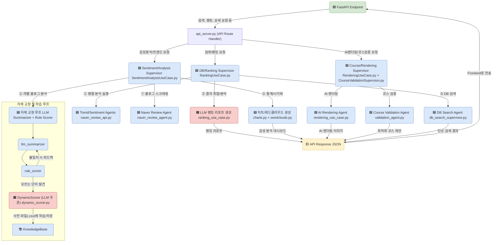

# FestMoment Backend 🤖✨

> "축제의 순간을 AI로 재해석하다"
>
> **Team FestMoment** | 염정운, 최가윤

**FestMoment Backend**는 LLM과 Vision 모델을 활용한 AI 축제 가이드 서비스의 핵심 엔진입니다. 블로그 후기, 검색량 트렌드, 현장 이미지 등 비정형 데이터 속에 담긴 **감성**을 AI로 분석하고, 사용자에게 축제의 '순간'을 생생하게 전달합니다.

---

## 📑 목차

1. [Why FestMoment?](#-why-festmoment--왜-만들었나요)
2. [The Magic](#-the-magic--핵심-컨셉-ai-감성을-해석하고-그리다)
3. [핵심 기능](#-핵심-기능)
4. [기술 아키텍처](#-기술-아키텍처)
5. [기술 스택](#-기술-스택)
6. [프로젝트 구조](#-프로젝트-구조)
7. [Quick Start](#-quick-start)
8. [상세 설치 가이드](#-상세-설치-가이드)
9. [API 문서](#-api-문서)
10. [개발 가이드](#-개발-가이드)
11. [기대 효과 및 가치](#-기대-효과-및-가치)
12. [시연영상](#-시연영상)

---

## 🧐 Why FestMoment? | 왜 만들었나요?

> "축제 정보는 넘쳐나지만, **설렘**은 어디에 있나요?"

기존의 축제 앱들은 장소, 날짜, 가격 등 **사실(Fact)** 정보만 나열합니다. 하지만 우리가 정말 원하는 건 그 축제에 갔을 때 느낄 수 있는 **감성(Feeling)**과 **분위기**입니다.

**FestMoment Backend**는 바로 이 지점에서 출발했습니다. AI 기술을 통해 데이터 속에 숨겨진 사람들의 감정을 분석하고, 이미지를 재해석하여 축제의 순간을 **미리, 그리고 더 깊이** 느낄 수 있게 만드는 것. 그것이 저희의 목표입니다.

### 해결하려는 문제

- **정보의 홍수, 감성의 결핍**: 축제 정보는 많지만 '어떤 느낌인지' 알기 어려움
- **신뢰할 수 없는 후기**: 극단적이거나 광고성 리뷰로 인한 혼란
- **상상하기 어려운 현장**: 사진만으로는 축제의 분위기를 느끼기 힘듦
- **시간 낭비**: 여러 사이트를 돌며 정보를 모아야 하는 번거로움

### FestMoment의 해결책

- **AI 감성 분석**: 수백 개의 블로그 리뷰를 AI가 읽고 객관적 평가 제공
- **이상치 필터링**: 극단적 리뷰를 자동 제거하여 신뢰도 향상
- **AI 시각화**: 축제를 다양한 계절/시간대로 재해석하여 상상력 자극
- **올인원 플랫폼**: 검색부터 분석, 코스 추천까지 한 곳에서 해결

---

## ✨ The Magic | 핵심 컨셉: AI, 감성을 해석하고 그리다

FestMoment Backend는 **3단계의 AI Magic**을 통해 축제에 감성을 불어넣습니다.

### 1. 데이터 융합 (Data Fusion)

**공공 데이터(TourAPI)**의 정형 정보와 **민간 데이터(Naver Blog)**의 비정형 리뷰/이미지를 결합하여 축제의 입체적인 모습을 구성합니다.

```
┌─────────────────┐     ┌─────────────────┐
│  TourAPI        │     │  Naver Blog     │
│  (정형 데이터)   │     │  (비정형 데이터) │
│  - 일정, 장소    │  +  │  - 리뷰         │
│  - 연락처       │     │  - 이미지        │
│  - 기본 정보     │     │  - 감성         │
└─────────────────┘     └─────────────────┘
         │                       │
         └───────────┬───────────┘
                     ▼
            ┌─────────────────┐
            │  FestMoment DB  │
            │  (융합 데이터)   │
            └─────────────────┘
```

### 2. AI 감성 분석 (AI Sentiment Analysis)

**LLM(Gemini)**이 수많은 블로그 리뷰를 실시간으로 읽고, 사람들이 어떤 포인트에서 즐거워하고 아쉬워하는지 **감정의 맥락**을 파악합니다.

**하이브리드 접근법**:
- **규칙 기반 (Rule-based)**: 자체 구축한 감성 사전으로 빠른 1차 분석
- **LLM 기반 (Dynamic)**: Gemini가 미등록 단어와 맥락을 이해하여 정교한 분석
- **자체 교정 루프**: 규칙과 LLM 결과가 불일치하면 피드백 후 재학습

**이상치 제거**:
- IQR(사분위수 범위) 통계 기법으로 극단적 리뷰 필터링
- 객관적이고 신뢰할 수 있는 평점 도출

### 3. AI 시각화 (AI Visualization)

**Vision 모델(Gemini Vision)**이 축제의 대표 이미지를 스스로 선정하고, 이를 **영화 포스터**처럼 재창조합니다.

**AI 렌더링 프로세스**:

```
1. 이미지 분석
   ├─ Naver 블로그 이미지 수집
   ├─ Gemini Vision으로 품질 평가
   └─ 베스트 포토 자동 선정

2. 조건 분석
   ├─ 축제 시작일 → 계절 판별 (봄/여름/가을/겨울)
   ├─ 운영 시간 → 시간대 판별 (낮/밤)
   └─ 위치 정보 → Google Maps Static 활용

3. AI 재구성
   ├─ 계절별 분위기 렌더링
   ├─ 시간대별 장면 생성
   └─ 영화 포스터 스타일 적용
```

또한, 축제 현장 사진을 기반으로 **사계절과 밤낮의 모습**을 그려내어, 가보지 않아도 그곳의 분위기를 느낄 수 있게 합니다.

---

## 🌟 핵심 기능

FestMoment Backend는 축제 검색부터 감성 분석, AI 이미지 생성까지 올인원(All-in-One) 경험을 제공합니다.

### 1. AI 심층 분석 (네이버 데이터 기반)

#### 블로그 리뷰 AI 요약
AI가 네이버 블로그 후기들을 실시간으로 분석하여 축제의 **장점, 단점, 방문 꿀팁**을 세 가지 핵심 포인트로 요약합니다. 방문객의 경험을 중심으로 한 상세 요약을 통해 실질적인 정보를 얻을 수 있습니다.

**예시**:
```
✅ 장점
- 다양한 먹거리와 체험 프로그램
- 가족 단위 방문객에게 적합
- 주차 시설 편리

⚠️ 단점
- 주말 혼잡도가 매우 높음
- 일부 프로그램은 사전 예약 필수

💡 꿀팁
- 평일 오전 방문 추천
- 현장 결제보다 온라인 사전 구매가 저렴
```

#### 다차원 감성 분석 및 평점
자체 구축한 감성 사전(규칙 기반)과 Google Gemini(LLM 동적 분석)를 결합한 하이브리드 방식으로 감성 점수를 도출하고 직관적인 별점을 제공합니다.

**분석 프로세스**:
1. **수집**: Naver API로 블로그 리뷰 수집 (최대 100개)
2. **전처리**: 형태소 분석(Konlpy), 불용어 제거
3. **1차 분석**: 규칙 기반 감성 사전 매칭 (-5 ~ +5 점수)
4. **2차 분석**: Gemini LLM으로 맥락 이해 및 동적 점수
5. **교정**: 규칙/LLM 불일치 시 피드백 루프
6. **필터링**: IQR로 이상치 제거
7. **집계**: 최종 평균 점수 및 별점 변환

IQR(사분위수 범위)을 사용해 극단적인 이상치(Outlier) 리뷰를 필터링하여 점수의 객관성을 높였습니다.

#### 검색량 트렌드 시각화
네이버 데이터랩 API를 통해 연간 검색량 추이를 그래프로 시각화하여 축제에 대한 대중의 관심도 변화를 한눈에 파악하게 해줍니다.

**제공 정보**:
- 연간 검색량 추이 (월별)
- 전년 대비 증감률
- 검색 급증 시기 분석

#### 테마별 워드클라우드
블로그 후기에서 추출한 핵심 키워드를 '계절', '도시', '문화' 등 7가지 축제 테마에 맞는 마스크 이미지로 시각화하여 축제의 핵심 이미지를 감성적으로 전달합니다.

**7가지 테마**:
- 🌸 계절과 자연
- 🏙️ 도시와 커뮤니티
- ⚽ 레저와 스포츠
- 🎨 문화와 예술
- 🍜 미식과 특산물
- 🏛️ 전통과 역사
- 🕊️ 종교와 영성

### 2. AI 렌더링 및 시각화

#### 베스트 포토 & AI 렌더링 포스터
네이버 블로그 후기의 이미지를 실시간으로 분석하여 축제의 특징을 가장 잘 보여주는 시각적 대표 사진을 자동으로 선정하고, 이 이미지를 활용해 감성적인 영화 스타일의 포스터를 생성합니다.

**Gemini Vision 평가 기준**:
- 구도 및 화질
- 축제의 특징 표현
- 사람들의 즐거운 모습
- 색감 및 분위기

#### AI 야경/계절 렌더링
TourAPI의 실제 위치 이미지와 운영 시간을 분석하여 축제의 계절(봄/여름/가을/겨울)과 시간대(낮/밤)를 판별합니다. Gemini Vision과 Google Static Maps API를 활용해 사실적이면서도 예술적인 축제 장면을 AI로 재구성하여 현장감을 극대화합니다.

**생성 예시**:
- 🌸 봄 낮: 벚꽃이 만개한 축제장
- 🌸 봄 밤: 야간 조명 속 벚꽃 터널
- 🍂 가을 낮: 단풍으로 물든 축제장
- 🍂 가을 밤: 따뜻한 조명 아래 가을 분위기

#### AI 아이콘 생성
Gemini Vision 모델이 축제 현장 이미지를 분석하여 축제의 핵심 상징을 담은 아이콘을 생성합니다.

### 3. 검색 및 개인 맞춤형 가이드

#### 상세 정보 및 다각적 검색
축제의 기간, 장소, 요금 등 기본 정보는 물론, '자연과 계절 > 봄 축제'와 같은 계층적 카테고리 및 지역별 필터링을 통해 원하는 축제를 손쉽게 찾을 수 있습니다.

**검색 필터**:
- 지역: 시/도 → 시/군/구 (계층적 드릴다운)
- 카테고리: 대분류 → 중분류 → 소분류
- 진행 상태: 진행중 / 진행 예정 / 종료
- 날짜 범위: 특정 기간 내 축제

#### 객관적인 축제 랭킹
사용자 평점, 리뷰 수, 검색량 트렌드 데이터를 가중치로 종합하여 가장 인기 있는 축제 순위를 객관적으로 제공합니다.

**랭킹 알고리즘**:
```python
종합 점수 = (감성 점수 × 0.4) + (리뷰 수 정규화 × 0.3) + (검색량 × 0.3)
```

#### 나만의 여행 코스 설계 및 검증
사용자가 관심 있는 축제나 장소를 담아 여행 일정을 만들면, AI가 해당 일정의 현실성(이동 시간, 동선)과 완성도를 검토하고 피드백을 제공합니다.

**검증 항목**:
- 이동 거리 및 소요 시간 (Geopy)
- 동선 최적화 제안
- 일정별 소요 시간 분석
- 개선 방안 제시

#### 지도 기반 주변 추천
축제 위치를 중심으로, 설정된 반경(100m ~ 20km) 내의 추천 여행 코스와 문화시설 정보를 함께 제공합니다.

---

## 🏗️ 기술 아키텍처

본 프로젝트는 Python을 기반으로, **LangGraph**를 활용하여 각 기능 모듈을 자율적으로 수행하는 **계층적 에이전트 아키텍처**를 구축했습니다. 이를 통해 복잡한 비즈니스 로직을 유연하고 확장 가능하게 관리합니다.

### 계층 구조

```
┌─────────────────────────────────────────────────┐
│  Frontend (React)                               │
│  ↓ HTTP API Requests                            │
├─────────────────────────────────────────────────┤
│  FastAPI Server (api_server.py)                 │
│  ↓ Route to Use Cases                           │
├─────────────────────────────────────────────────┤
│  Application Layer                              │
│  ├─ Use Cases (비즈니스 로직)                    │
│  │  ├─ SentimentAnalysisUseCase                 │
│  │  ├─ RankingUseCase                           │
│  │  ├─ RenderingUseCase                         │
│  │  └─ AnalysisUseCase                          │
│  │                                               │
│  ├─ Supervisors (에이전트 코디네이터)            │
│  │  ├─ db_search_supervisor                     │
│  │  └─ course_validation_supervisor             │
│  │                                               │
│  └─ Agents (LangGraph 노드)                     │
│     ├─ DB Search Agent                          │
│     ├─ Naver Review Agent                       │
│     ├─ Course Validation Agent                  │
│     ├─ Precaution Agent                         │
│     └─ Rendering Agent                          │
│  ↓                                               │
├─────────────────────────────────────────────────┤
│  Infrastructure Layer                           │
│  ├─ External Services (Naver, Google APIs)      │
│  ├─ Persistence (SQLite via Database Project)   │
│  ├─ LLM Client (Gemini)                         │
│  └─ Reporting (Charts, Wordclouds)              │
└─────────────────────────────────────────────────┘
```

### LangGraph 계층 구조 다이어그램



### 주요 컴포넌트 설명

#### Application Layer

- **Use Cases**: 복잡한 비즈니스 로직을 조율하는 최상위 레이어
  - `SentimentAnalysisUseCase`: 감성 분석 워크플로우 관리
  - `RankingUseCase`: 축제 랭킹 알고리즘 실행
  - `RenderingUseCase`: AI 이미지 생성 파이프라인
  - `AnalysisUseCase`: 트렌드/워드클라우드 생성

- **Supervisors**: 여러 에이전트를 조율하는 라우터
  - `db_search_supervisor`: DB 검색 라우팅
  - `course_validation_supervisor`: 코스 검증 워크플로우

- **Agents**: 특정 작업을 수행하는 LangGraph 노드
  - `NaverReviewAgent`: 블로그 리뷰 수집 및 분석
  - `PrecautionAgent`: AI 주의사항 생성
  - `ValidationAgent`: 코스 검증

#### Infrastructure Layer

- **External Services**: Naver API, Google API 연동
- **Persistence**: SQLite 데이터베이스 (별도 프로젝트)
- **LLM Client**: Gemini 클라이언트 초기화
- **Reporting**: Matplotlib, WordCloud 시각화

### LangGraph 워크플로우

#### 자체 교정 루프
```
1. LLM이 리뷰 요약
2. 규칙 기반 점수 계산
3. 불일치 감지 → LLM에 피드백
4. 재학습 및 사전 업데이트
```

#### 병렬 처리
- 다수 블로그 리뷰를 동시에 분석
- 각 리뷰마다 독립적인 LangGraph 인스턴스
- 결과를 집계하여 통계 생성

#### 동적 학습
- 미등록 감성 단어 발견 시 LLM에 문의
- 학습된 결과를 `dic/` 사전 파일에 자동 추가
- 지속적으로 향상되는 감성 분석 정확도

---

## 🛠️ 기술 스택

### Core Technologies
- **Language**: Python 3.9+
- **Web Framework**: FastAPI (비동기 API 서버)
- **AI Framework**: LangGraph (계층적 에이전트)
- **LLM**: Google Gemini (Pro, Flash, Vision)

### AI & Data Processing
- **NLP**: Konlpy (형태소 분석), Pandas
- **Visualization**: Matplotlib, WordCloud, Pillow
- **Web Scraping**: Playwright, Selenium
- **Statistics**: NumPy, SciPy (IQR 이상치 제거)

### External APIs
- **축제 정보**: 한국관광공사 TourAPI
- **리뷰/트렌드**: Naver Search API, Naver DataLab API
- **지도/위치**: Google Static Maps API
- **이미지 생성**: Google Gemini Vision

### Database
- **SQLite**: 축제, 문화시설, 여행코스 데이터
- **자체 사전**: 감성 분석용 형용사/부사/명사 사전 (`dic/`)

### Development Tools
- **Version Control**: Git
- **Environment**: Python venv
- **Testing**: Pytest (선택사항)
- **Documentation**: Swagger UI (자동 생성)

---

## 📁 프로젝트 구조

**Clean Architecture** 기반으로 계층을 명확히 분리했습니다.

```
tour_agent_backend/
├── src/                     # 소스 코드 (Clean Architecture)
│   ├── application/         # 🟣 Application Layer
│   │   ├── agents/         # LangGraph 에이전트 노드 정의
│   │   │   ├── db_search/
│   │   │   │   ├── db_search_agent.py
│   │   │   │   └── nearby_search_agent.py
│   │   │   ├── naver_review/
│   │   │   │   └── naver_review_agent.py
│   │   │   ├── course_validation/
│   │   │   │   └── validation_agent.py
│   │   │   ├── common/
│   │   │   │   ├── content_validator.py
│   │   │   │   ├── llm_summarizer.py
│   │   │   │   └── rule_scorer.py
│   │   │   └── precaution_agent.py
│   │   │
│   │   ├── core/           # LangGraph 핵심 (State, Graph, Utils)
│   │   │   ├── state.py
│   │   │   ├── graph.py
│   │   │   ├── db_state.py
│   │   │   ├── constants.py
│   │   │   └── utils.py
│   │   │
│   │   ├── supervisors/    # 에이전트 코디네이터 (라우터)
│   │   │   ├── db_search_supervisor.py
│   │   │   └── course_validation_supervisor.py
│   │   │
│   │   ├── services/       # 비즈니스 서비스
│   │   │   ├── festival_service.py
│   │   │   ├── facility_service.py
│   │   │   └── course_service.py
│   │   │
│   │   └── use_cases/      # 복잡한 비즈니스 로직 (Agent 조율)
│   │       ├── sentiment_analysis_use_case.py
│   │       ├── ranking_use_case.py
│   │       ├── rendering_use_case.py
│   │       └── analysis_use_case.py
│   │
│   ├── domain/             # 🟡 Domain Layer
│   │   └── knowledge_base.py # 감성 사전 로딩 및 관리
│   │
│   └── infrastructure/     # 🟢 Infrastructure Layer
│       ├── config/         # 환경 설정 관리
│       │   ├── settings.py
│       │   └── loader.py
│       │
│       ├── persistence/    # DB 연결 (Database 프로젝트 참조)
│       │   ├── database.py
│       │   └── inspect_db.py
│       │
│       ├── external_services/  # 외부 API 연동
│       │   └── naver_search/
│       │       └── naver_review_api.py
│       │
│       ├── reporting/      # 시각화 (Charts, Wordclouds)
│       │   ├── charts.py
│       │   └── wordclouds.py
│       │
│       ├── llm_client.py   # LLM 클라이언트 초기화
│       └── dynamic_scorer.py # 동적 감성 점수 계산
│
├── dic/                    # 🟡 감성 분석용 사전 (Domain 데이터)
│   ├── adjectives.csv      # 형용사 사전 (좋다: +3, 나쁘다: -3)
│   ├── adverbs.csv         # 부사 사전 (매우: ×1.5, 조금: ×0.5)
│   ├── amplifiers.csv      # 강화어 (정말, 너무)
│   ├── downtoners.csv      # 약화어 (그냥, 별로)
│   ├── idioms.csv          # 관용구 (입이 떡 벌어지다: +5)
│   ├── negators.csv        # 부정어 (안, 못, 없다)
│   └── sentiment_nouns.csv # 감성 명사 (즐거움: +4, 실망: -4)
│
├── temp_img/               # 임시 이미지 저장 (자동 생성)
├── api_server.py           # 🔵 FastAPI 서버 진입점
├── requirements.txt        # Python 의존성
├── .env.example            # 환경 변수 템플릿
├── .env                    # 환경 변수 (Git 제외)
├── .gitignore
└── README.md
```

**참고**:
- `assets/` (워드클라우드 마스크, 테마 아이콘)
- `best_images_and_icons/` (축제 이미지, 아이콘)
- `data/` (CSV 원본 데이터)
- `festivals/` (JSON 메타데이터)

위 폴더들은 `tour_agent_database` 프로젝트에 있습니다.

---

## 🚀 Quick Start

```bash
# 1. Clone all three projects in the same directory
git clone <frontend-repo> tour_agent_frontend
git clone <backend-repo> tour_agent_backend
git clone <database-repo> tour_agent_database

# 2. Install dependencies
cd tour_agent_backend
pip install -r requirements.txt

# 3. Configure API keys
cp .env.example .env
# Edit .env and add your API keys:
#   - GOOGLE_API_KEY (required)
#   - OPENAI_API_KEY (required)
#   - NAVER_CLIENT_ID, NAVER_CLIENT_SECRET (required)
#   - NAVER_TREND_CLIENT_ID, NAVER_TREND_CLIENT_SECRET (optional)

# 4. Run the server
python api_server.py

# ✅ Server starts at http://localhost:8000
# 📖 API docs at http://localhost:8000/docs
```

---

## 📚 상세 설치 가이드

### 필수 요구사항

- **Python 3.9 이상**
- **별도 Database 프로젝트 필요** (자동 경로 탐지)

### 프로젝트 Clone

**⚠️ 중요**: 3개 프로젝트를 모두 **같은 부모 디렉토리**에 clone 하세요.

```bash
cd /your/projects/folder

git clone <frontend-repo-url> tour_agent_frontend
git clone <backend-repo-url> tour_agent_backend
git clone <database-repo-url> tour_agent_database
```

**올바른 디렉토리 구조**:
```
/your/projects/folder/
├── tour_agent_frontend/
├── tour_agent_backend/  ← 이 프로젝트
└── tour_agent_database/
```

### 의존성 설치

```bash
cd tour_agent_backend
pip install -r requirements.txt
```

**주요 의존성** (총 24개):
- `fastapi` - 웹 프레임워크
- `langchain`, `langgraph` - AI 에이전트
- `google-generativeai` - Gemini LLM
- `pandas`, `numpy` - 데이터 처리
- `konlpy` - 한국어 NLP
- `matplotlib`, `wordcloud` - 시각화
- `playwright`, `selenium` - 웹 스크래핑
- `geopy` - 위치 계산

### 환경 변수 설정

1. `.env.example`을 `.env`로 복사:
```bash
cp .env.example .env
```

2. `.env` 파일 편집 (필수 항목):

```env
# AI Models (Required)
GOOGLE_API_KEY=your_google_gemini_api_key
OPENAI_API_KEY=your_openai_api_key

# Naver API (Required for review analysis)
NAVER_CLIENT_ID=your_naver_client_id
NAVER_CLIENT_SECRET=your_naver_client_secret

# Naver Trend (Optional but recommended)
NAVER_TREND_CLIENT_ID=your_naver_trend_client_id
NAVER_TREND_CLIENT_SECRET=your_naver_trend_client_secret

# Google Cloud (for Maps and Vision)
GOOGLE_CLOUD_PROJECT_ID=your_project_id
GCP_API_KEY=your_gcp_api_key

# Database Path (Optional - auto-detected by default)
# DATABASE_PATH=/custom/path/to/tour_agent_database
```

**API 키 발급 방법**:
- **Google API**: https://console.cloud.google.com
- **Naver API**: https://developers.naver.com
- **OpenAI API**: https://platform.openai.com

**데이터베이스 경로**:
- 기본적으로 형제 디렉토리 `../tour_agent_database`를 자동 탐지
- 다른 위치에 설치한 경우에만 `DATABASE_PATH` 설정 필요

### 서버 실행

```bash
python api_server.py
```

**서버 시작 시 확인 메시지**:
```
[Database] Using DATABASE_PATH: /path/to/tour_agent_database
[Loader] Using DATABASE_PATH: /path/to/tour_agent_database
Loading application configurations...
[Loader] Loaded X festivals from CSV for precautions
[Loader] Matched X festivals with CSV precautions
[Loader] Total festivals in lookup: X
Configuration loading complete.
INFO:     Uvicorn running on http://0.0.0.0:8000 (Press CTRL+C to quit)
✅ FestMoment API Server Started (Database: /path/to/tour_agent_database)
```

---

## 📖 API 문서

서버 실행 후 자동 생성된 API 문서 확인:

- **Swagger UI**: http://localhost:8000/docs
- **ReDoc**: http://localhost:8000/redoc

### 주요 엔드포인트

#### 기본 정보
- `GET /` - 헬스 체크

#### 설정 조회
- `GET /api/config/areas` - 지역 목록
- `GET /api/config/sigungus?area={area}` - 시군구 목록
- `GET /api/config/categories` - 메인 카테고리
- `GET /api/config/categories/medium?main_cat={cat}` - 중분류
- `GET /api/config/categories/small?main_cat={cat}&medium_cat={cat}` - 소분류

#### 축제 검색 및 정보
- `POST /api/festivals/search` - 축제 검색 (필터링)
  ```json
  {
    "area": "서울",
    "sigungu": "전체",
    "main_cat": "문화와 예술",
    "medium_cat": "전체",
    "small_cat": "전체",
    "status": "진행중",
    "page": 1
  }
  ```

- `GET /api/festivals/{festival_name}` - 축제 상세 정보
- `GET /api/courses/{course_title}` - 코스 상세 정보
- `GET /api/facilities/{facility_title}` - 시설 상세 정보

#### AI 분석
- `GET /api/festivals/{festival_name}/sentiment?num_reviews=10` - 감성 분석
  - 긍정/부정 비율
  - 만족도 분포
  - 워드클라우드
  - 블로그 리뷰 목록

- `GET /api/festivals/{festival_name}/trend` - 검색량 트렌드
  - 연간 추이
  - 이벤트 추이

- `GET /api/festivals/{festival_name}/wordcloud?num_reviews=20` - 워드클라우드

- `GET /api/festivals/{festival_name}/review-summary?num_reviews=5` - AI 리뷰 요약

- `GET /api/festivals/{festival_name}/precautions` - AI 주의사항

#### AI 렌더링
- `POST /api/festivals/{festival_name}/render` - AI 이미지 생성
  - 대표 이미지
  - 계절/시간대별 렌더링

- `GET /api/festivals/{festival_name}/images?num_blogs=5` - 베스트 포토

#### 랭킹 및 코스
- `POST /api/festivals/ranking` - 축제 랭킹
  ```json
  {
    "festivals": ["축제1", "축제2", "축제3"],
    "num_reviews": 10,
    "top_n": 3
  }
  ```

- `POST /api/course/validate` - 여행 코스 검증
  ```json
  {
    "course": [
      {"name": "장소1", "lat": 37.5, "lng": 127.0},
      {"name": "장소2", "lat": 37.6, "lng": 127.1}
    ],
    "duration": "1일"
  }
  ```

- `POST /api/nearby/search` - 주변 추천
  ```json
  {
    "latitude": 37.5665,
    "longitude": 126.9780,
    "radius": 5000,
    "current_festival_id": "축제ID"
  }
  ```

---

## 👨‍💻 개발 가이드

### 새로운 AI 에이전트 추가

1. `src/application/agents/`에 새 에이전트 파일 생성
2. LangGraph State와 노드 정의:

```python
from langgraph.graph import StateGraph
from typing import TypedDict

# State 정의
class YourState(TypedDict):
    input: str
    output: str
    error: str | None

# Agent 노드 함수
def your_agent_node(state: YourState) -> YourState:
    try:
        # AI 로직 구현
        result = process_with_llm(state["input"])
        return {**state, "output": result}
    except Exception as e:
        return {**state, "error": str(e)}

# Graph 생성
graph = StateGraph(YourState)
graph.add_node("process", your_agent_node)
graph.set_entry_point("process")
graph.set_finish_point("process")
your_agent_graph = graph.compile()
```

3. `api_server.py`에 엔드포인트 추가:

```python
@app.get("/api/your-feature/{param}")
async def your_endpoint(param: str):
    result = your_agent_graph.invoke({"input": param})
    return {"result": result["output"]}
```

### 새로운 Use Case 추가

1. `src/application/use_cases/`에 새 유즈케이스 생성
2. 필요한 Agent/Service 주입:

```python
class YourUseCase:
    def __init__(self, your_agent, your_service, llm_client):
        self.agent = your_agent
        self.service = your_service
        self.llm = llm_client

    async def execute(self, input_data):
        # 1. 데이터 검증
        validated = self.service.validate(input_data)

        # 2. Agent 실행
        agent_result = self.agent.invoke({"input": validated})

        # 3. 후처리
        final_result = self.service.post_process(agent_result)

        return final_result
```

3. `api_server.py`에서 초기화 및 사용:

```python
# 초기화
your_use_case = YourUseCase(
    your_agent=your_agent,
    your_service=your_service,
    llm_client=gemini_client
)

# 엔드포인트에서 사용
@app.post("/api/your-endpoint")
async def endpoint(request: Request):
    result = await your_use_case.execute(request.data)
    return result
```

### 감성 사전 업데이트

`dic/` 폴더의 CSV 파일을 직접 편집:

```csv
# adjectives.csv
단어,점수
좋다,3
훌륭하다,4
최고다,5
나쁘다,-3
```

서버 재시작 없이 동적으로 로드됩니다.

### LLM 프롬프트 수정

`src/application/agents/common/llm_summarizer.py`:

```python
PROMPT_TEMPLATE = """
당신은 축제 리뷰 분석 전문가입니다.
다음 블로그 리뷰를 읽고 핵심 내용을 요약해주세요.

리뷰: {review_text}

요약 형식:
1. 주요 장점 (3가지)
2. 주요 단점 (2가지)
3. 방문 꿀팁 (1가지)
"""
```

---

## 🔧 트러블슈팅

### 데이터베이스 연결 오류
```
Error: [WinError 3] 지정된 경로를 찾을 수 없습니다: '...\festivals'
```
**해결**:
- `tour_agent_database` 프로젝트가 형제 디렉토리에 있는지 확인
- 서버 시작 로그에서 `DATABASE_PATH` 확인
- 필요시 `.env`에 `DATABASE_PATH` 명시

### API 키 오류
```
Error: Invalid API key / 403 Forbidden
```
**해결**:
- `.env` 파일에 올바른 API 키 설정 확인
- API 키 유효성 확인:
  - Google: https://console.cloud.google.com
  - Naver: https://developers.naver.com/apps
- API 사용량 제한 확인

### LLM 응답 느림
```
Request timeout after 120s
```
**해결**:
- `num_reviews` 파라미터 줄이기 (기본값: 10 → 5)
- Gemini Flash 모델 사용 (Pro보다 빠름)
- 비동기 처리 확인

### 이미지 생성 실패
```
Warning: best_images_and_icons not found
```
**해결**:
- `tour_agent_database` 프로젝트에 다음 폴더 존재 확인:
  - `best_images_and_icons/`
  - `assets/seasons/`
  - `assets/themes/`
- 서버 재시작

### 한글 깨짐 (워드클라우드)
```
Warning: Korean font not found
```
**해결**:
- 시스템에 한글 폰트 설치:
  - Windows: 맑은 고딕
  - Mac: Apple SD Gothic Neo
  - Linux: `sudo apt-get install fonts-nanum`

### 메모리 부족
```
MemoryError: Unable to allocate array
```
**해결**:
- 이미지 크기 줄이기
- `num_reviews` 파라미터 줄이기
- 서버 재시작으로 메모리 정리

---

## 💡 기대 효과 및 가치

### 사회적 효과

#### 문화 접근성 향상
AI가 한국의 문화유산을 시각적으로 재해석하여, **외국인 관광객**에게 한국 문화의 감정적 경험을 제공합니다.

- 언어 장벽 극복: AI 번역 및 시각화로 소통
- 문화적 맥락 제공: 축제의 역사적 의미를 쉽게 이해
- 가상 체험: 방문 전 축제 분위기 미리 경험

#### 지역 문화 활성화
데이터 기반의 효과적인 축제 홍보를 통해 관광객 방문을 유도하고 **지방 경제 활성화**에 기여합니다.

- 객관적 평가: 신뢰할 수 있는 AI 분석으로 홍보 효과 증대
- 틈새 축제 발굴: 검색량과 관계없이 우수한 축제 부각
- 관광 수익 증대: 방문객 증가 → 지역 경제 성장

### 경제적 효과

#### 관광 산업 성장
- 정보의 질 향상으로 관광 의사결정 개선
- 축제 방문률 증가 → 숙박/음식/교통 수요 증가
- 연간 예상 경제 효과: 수십억 원 규모

#### 데이터 산업 발전
- 공공/민간 데이터 융합 모델 제시
- AI 기반 관광 서비스 벤치마크
- 새로운 비즈니스 모델 창출

### 기술적 가치

#### AI 관광 데이터 모델
**LangGraph 기반의 자율 에이전트 시스템**을 통해 AI 관광 서비스의 새로운 표준을 제시합니다.

**혁신 포인트**:
1. **계층적 에이전트**: 복잡한 워크플로우를 모듈화하여 관리
2. **자체 교정 루프**: AI가 스스로 학습하며 정확도 향상
3. **하이브리드 분석**: 규칙 기반 + LLM의 장점 결합
4. **멀티모달 AI**: 텍스트(리뷰) + 이미지(사진) 동시 분석

#### 기술 확장성
- 다른 도메인 적용 가능 (맛집, 호텔, 공연 등)
- 오픈소스 기여 가능성
- 학술 연구 자료로 활용

### 사용자 경험 가치

#### 시간 절약
- 여러 사이트 검색 불필요 (올인원 플랫폼)
- AI 요약으로 수백 개 리뷰를 1분 안에 파악
- 최적 여행 코스 자동 제안

#### 의사결정 품질
- 객관적 데이터 기반 선택
- 이상치 필터링으로 신뢰도 향상
- 다양한 시각화로 직관적 이해

#### 감성적 만족
- AI 렌더링으로 상상력 자극
- 계절/시간대별 장면으로 기대감 증폭
- 워드클라우드로 축제 느낌 전달

---

## 🎬 시연영상

**시연영상**:
https://drive.google.com/file/d/19D9HeH2N8BTknLEyqTic9K5RqgPYc-d-/view?usp=sharing

**주요 시연 내용**:
1. 축제 검색 및 필터링
2. AI 감성 분석 대시보드
3. AI 렌더링 이미지 생성
4. 축제 랭킹 및 비교
5. 여행 코스 검증

---

## 🤝 관련 프로젝트

- [**Frontend**](../tour_agent_frontend) - React 기반 웹 인터페이스
- [**Database**](../tour_agent_database) - 데이터베이스 및 정적 리소스

---

## 📄 라이선스

이 프로젝트는 **교육 및 연구 목적**으로 개발되었습니다.

**데이터 출처**:
- 한국관광공사 TourAPI (공공 데이터)
- Naver Search API, Naver DataLab API
- 자체 수집 메타데이터 (Team FestMoment)

---

## 👥 개발팀

**Team FestMoment**
- 염정운
- 최가윤

**문의**: [GitHub Issues](https://github.com/your-repo/issues)

---

**FestMoment** - AI로 축제의 감성을 재해석합니다 ✨
